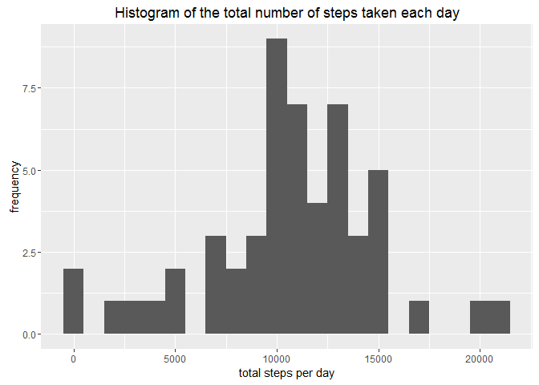
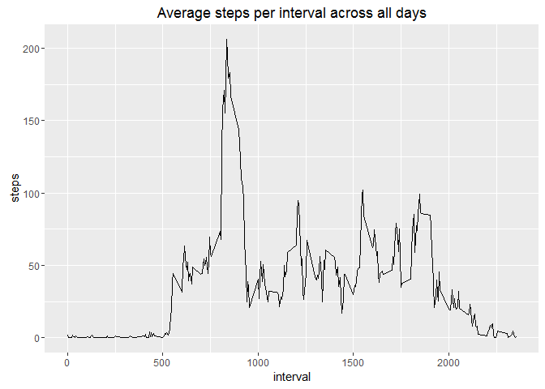
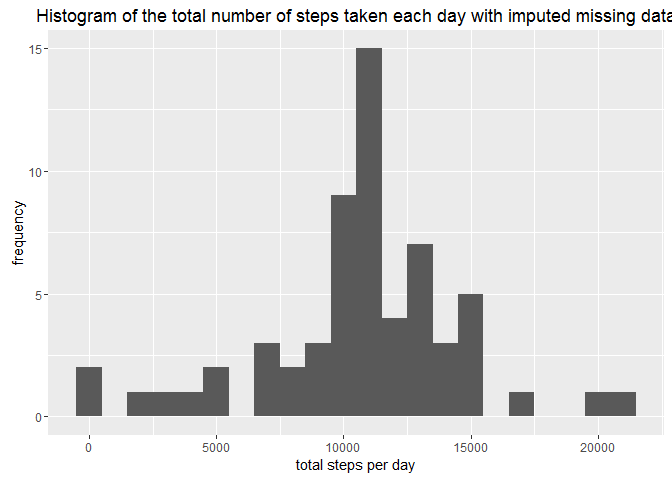
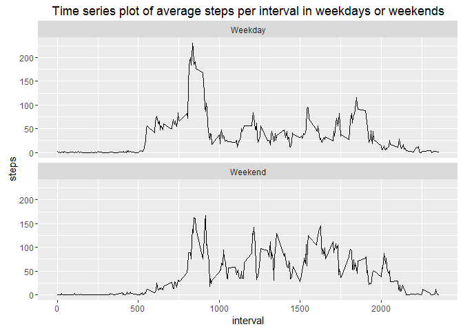

# Reproducible Research: Peer Assesment 1
sjors  
October 12, 2016  
This assignment is the first peer graded assignment in the Reproducible Research course on Coursera. For more information on the assignment, see the README file.

### Preparations in R
As a first step the required libraries are loaded.


```r
library(ggplot2)
```


## Loading and preprocessing the data
The required data is loaded using read.csv. It is assumed the data is already unzipped and the workspace is already set correctly.

```r
activity<-read.csv("./activity.csv", header=TRUE, sep=",", colClasses = c("numeric", "character","numeric"))
```


## What is mean total number of steps taken per day?
For this part, missing values in the dataset are ignored.

This question is answered in three steps:
  
1. Calculate the total number of steps taken per day

```r
totalSteps<-aggregate(steps~date, activity, sum)
```
  
2. Make a histogram of the total number of steps taken each day

```r
ggplot(totalSteps, aes(x=steps))+
  geom_histogram(binwidth=1000)+
  labs(title="Histogram of the total number of steps taken each day",x="total steps per day", y="frequency")
```

<!-- -->
  
3. Calculate and report the mean and median of the total number of steps taken per day

```r
meanSteps<-mean(totalSteps$steps)
medianSteps<-median(totalSteps$steps)
```
The mean is 1.0766189\times 10^{4} the median is 1.0765\times 10^{4} steps per day.


## What is the average daily activity pattern?
This question is answered by:  
  
1. Making a time series plot of the 5-minue interval and the average number of steps taken, averaged across all days 
  
First the average number of steps per interval averaged over all days is calculated  

```r
averageInterval<-aggregate(steps~interval, activity, mean, na.rm=T)
```
This is used as input for the time series plot  

```r
ggplot(averageInterval, aes(x=interval, y=steps))+
  geom_line()+
  labs(title="Average steps per interval across all days", xlab="interval", ylab="average steps")
```

<!-- -->
  
2. Determining which 5-minute interval, on average across all the days in the dataset, contains the maximum number of steps  

```r
maxSteps<-averageInterval[which.max(averageInterval$steps),]
```
  
The 835th interval has the maximum average value of 206.1698113 steps  

## Imputing missing values
Note that there are a number of days/intervals where there are missing values (coded as NA). The presence of missing days may introduce bias into some calculations or summaries of the data. Therefore, multiple steps are performed to impute these missing values:  
  
1. The total number of missing values in the dataset is calculated and reported  

```r
missingValues<-sum(is.na(activity$steps))
```
There are 2304 missing values in the dataset.  
  
2. A strategy for filling the missing values is devised; all missing values are replaced by the average number of steps for that timeslot(over all days).  
First, a function to replace these values is created:  

```r
fill<-function(steps,interval){
  newColumn<-NA
  if(is.na(steps))
    newColumn<-averageInterval[averageInterval$interval==interval, "steps"]
  else
    newColumn<-c(steps)
}
```
  
3. Using this formula, a new dataset (without missing values) is created:  

```r
newActivity<-activity
newActivity$steps<-mapply(fill,newActivity$steps, newActivity$interval)
```
  
4. Again a histogram of the total number of steps per day is made, also the mean and median total number of steps taken per day are recalculated. These values are compared to the ones that didn't take the missing values into account.  

```r
newTotalSteps<-aggregate(steps~date, newActivity, sum)
ggplot(newTotalSteps, aes(x=steps))+
  geom_histogram(binwidth=1000)+
  labs(title="Histogram of the total number of steps taken each day with imputed missing data",x="total steps per day", y="frequency")
```

<!-- -->

```r
newMeanSteps<-mean(newTotalSteps$steps)
newMedianSteps<-median(newTotalSteps$steps)
```
    
The (new) mean and median average steps per day are now compared to the ones that didn't take missing values into account:  
+ The new mean is 1.0766189\times 10^{4}, it was 1.0766189\times 10^{4}.  
+ The new median is 1.0766189\times 10^{4}, it was 1.0765\times 10^{4}.  
Only the value of the median is (very) slightly different, so the impact of imputing the missing values is very small.

## Are there differences in activity patterns between weekdays and weekends?
This question is answered in two parts: 
  
1. First a new factor variable is introduced in the dataset, indicating whether a day is a weekday or if its weekend. A function is created to add this variable to the dataset (after the format of the date variable is set to the date format):  

```r
newActivity$date<-as.Date(newActivity$date, "%Y-%m-%d")
day<-function(date){
  weekday<-weekdays(date)
  if (weekday %in% c("Monday", "Tuesday", "Wednesday", "Thursday", "Friday"))
    return("Weekday")
  else if (weekday %in% c("Saturday", "Sunday"))
    return("Weekend")
  else
    stop()
}
newActivity$day<-sapply(newActivity$date, FUN=day)
```
  
2. This new variable is used to make a panel plot containing a time series plot of the 5 minute interval and the average number of steps taken, averaged across all the weekdays or weekend days:  

```r
newAverageInterval<-aggregate(steps~interval+day, newActivity, mean, na.rm=T)
ggplot(newAverageInterval, aes(x=interval, y=steps))+
  geom_line()+
  labs(title="Time series plot of average steps per interval in weekdays or weekends",
       xlab="interval", ylab="average steps")+
  facet_wrap(~day, ncol=1, nrow=2)
```

<!-- -->


